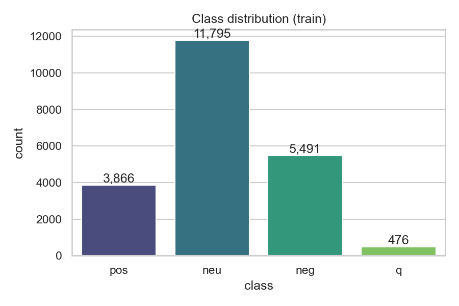
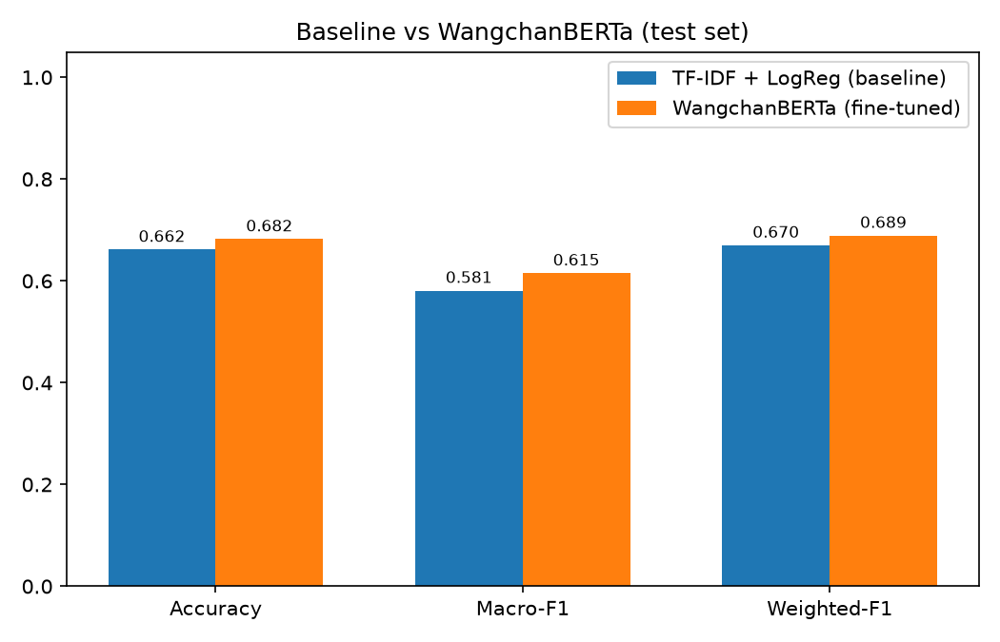
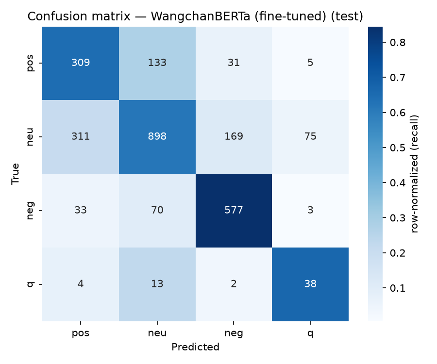

# 🇹🇭 Thai Sentiment Classification with WangchanBERTa

> Fine-tune **WangchanBERTa** to classify Thai sentiment into 4 classes (positive / neutral / negative / question)
> on the **Wisesight Sentiment Corpus** and perform a head-to-head comparison with a classical baseline (TF-IDF + Logistic Regression).
> Achieved **macro-F1 = 0.6151**, outperforming the baseline by **0.0342** points.

🔗 **Live demo:** `<insert Hugging Face Space link here>`

> ⚙️ Numeric values with `<fill>` will be automatically updated after running the pipeline — check the actual values in [`reports/metrics.json`](reports/metrics.json) and [`reports/comparison.md`](reports/comparison.md).

---

## 1. Problem statement

Classifying sentiment from Thai social media text is highly applicable in real-world scenarios, such as voice of customer analysis, support ticket routing, and brand monitoring. However, Thai language processing comes with unique challenges:
**Lack of word boundaries**, **code-mixing** (mixing with English), emojis, misspellings, and sarcasm.
This project addresses the question: *How much does a transformer model pre-trained specifically on a large Thai corpus actually help compared to a simpler baseline?*

## 2. Dataset

- **Wisesight Sentiment Corpus** — [`pythainlp/wisesight_sentiment`](https://huggingface.co/datasets/pythainlp/wisesight_sentiment)
- Thai social media texts from 2016–2019 (primarily product/service reviews).
- **4 classes:** `positive`, `neutral`, `negative`, `question`
- **Highly Imbalanced** — `neutral` is the largest class, while `question` is a very small minority → Thus, **macro-F1** is selected as the primary metric.



## 3. Approach

| Step | Details |
|------|-----------|
| **Preprocessing** | Light cleaning (collapse whitespace + `pythainlp.normalize`); **no** word segmentation before feeding into the transformer — let SentencePiece handle it. |
| **Split** | **Stratified** train/val/test splits (fixed seed) — both baseline and transformer use the exact same splits for a fair comparison. |
| **Baseline** | `pythainlp.word_tokenize` (newmm) → TF-IDF (1–2 gram) → Logistic Regression (`class_weight="balanced"`) |
| **Transformer** | Fine-tune `airesearch/wangchanberta-base-att-spm-uncased` + **weighted CrossEntropy loss** to handle class imbalance. |
| **Imbalance Handling** | Macro-F1 as the primary metric + weighted loss / balanced class weights for both models. |
| **Selection** | Select the best checkpoint based on `f1_macro` on the validation set + early stopping. |

> **Why WangchanBERTa and not mBERT/XLM-R?** — Pre-trained on a massive Thai corpus (~78.5GB), it understands Thai context significantly better than multilingual models.

## 4. Results

Evaluated on the exact same **test set** for both models (actual values are in `reports/comparison.md`):

| Model | Accuracy | Macro-F1 | Weighted-F1 |
|-------|----------|----------|-------------|
| TF-IDF + LogReg (baseline) | 0.6615 | 0.5809 | 0.6699 |
| WangchanBERTa (fine-tuned) | 0.6821 | 0.6151 | 0.6890 |



Confusion matrices:

| Baseline | WangchanBERTa |
|----------|---------------|
|  |  |

> 📊 **Expectation (hedged):** Given the heavy imbalance of this dataset, macro-F1 typically falls around **0.65–0.75**, and the `question` class usually gets the lowest F1 score.
> It is completely normal for macro-F1 < weighted-F1 in highly imbalanced data.

## 5. Key findings & error analysis

(Summarized from [`reports/error_analysis.md`](reports/error_analysis.md) — generated from actual misclassified examples)

- The model struggles most between **neutral ↔ negative** (the boundary is very thin).
- The **`question`** class is the hardest to predict due to the lack of training data → this is partially mitigated by the weighted loss.
- Remaining errors are largely due to **code-mixing / emojis / sarcasm**.
- **If given more time:** Apply data augmentation for the `question` class, group emojis as specific tokens, or try larger models/ensembling.

## 6. How to run

```bash
# 1) Install dependencies (sentencepiece + accelerate are required)
pip install -r requirements.txt

# 2) EDA (Open in Jupyter/Colab)
#    notebooks/01_eda.ipynb  -> Generates figures in reports/figures/

# 3) Baseline (Can be run on CPU)
python -m src.baseline

# 4) Fine-tune WangchanBERTa (GPU required; Google Colab T4 recommended)
python -m src.train

# 5) Evaluate + Compare baseline ↔ transformer on the test set
python -m src.evaluate

# 6) Error analysis
python -m src.error_analysis

# 7) Demo
python app/app.py
```

**On Google Colab:**
```python
!git clone <repo-url> && cd thai-sentiment
!pip install -r requirements.txt
!python -m src.baseline && python -m src.train && python -m src.evaluate
```

> Run all commands from the **root of the repo** (so that `import config` / `import src.*` work properly).

## 7. Tech stack

`Python` · `PyTorch` · `Hugging Face transformers (Trainer)` · `datasets` · `scikit-learn` · `PyThaiNLP (newmm)` · `SentencePiece` · `Gradio` · `matplotlib/seaborn`

## 8. Project structure

```
thai-sentiment/
├── config.py              # Central configuration (model, paths, hyperparams, seed)
├── requirements.txt
├── notebooks/01_eda.ipynb # EDA + figures
├── src/
│   ├── data.py            # load + clean + stratified split (reproducible)
│   ├── baseline.py        # TF-IDF + Logistic Regression
│   ├── train.py           # fine-tune WangchanBERTa (weighted Trainer)
│   ├── evaluate.py        # metrics + confusion matrix + comparison
│   ├── error_analysis.py  # misclassified examples
│   └── utils.py           # seed, metrics IO, plotting (shared)
├── app/app.py             # Gradio demo
├── reports/               # metrics.json, comparison.md, figures/
└── models/                # Models (gitignore; to be pushed to HF Hub)
```

---

### Acknowledgements
- Dataset: Wisesight Sentiment Corpus (via PyThaiNLP)
- Model: [WangchanBERTa](https://huggingface.co/airesearch/wangchanberta-base-att-spm-uncased) (VISTEC-depa AI Research Institute of Thailand)
